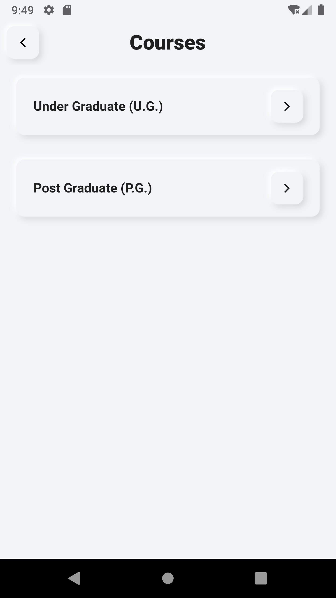
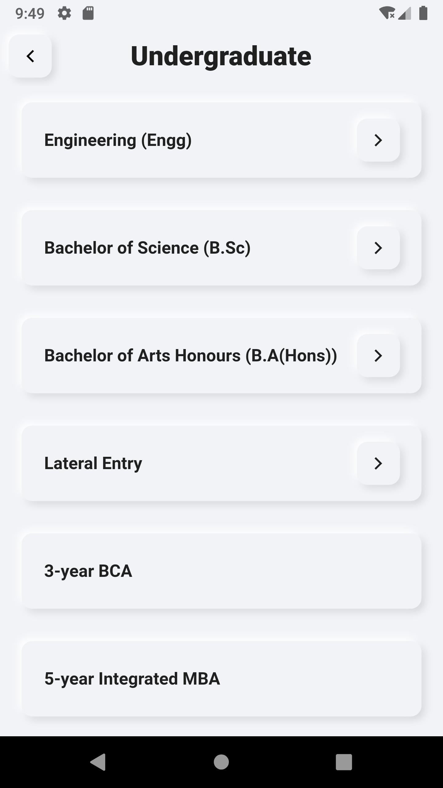
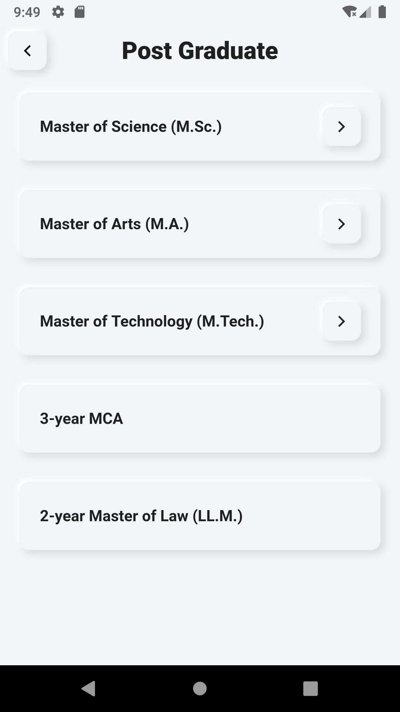
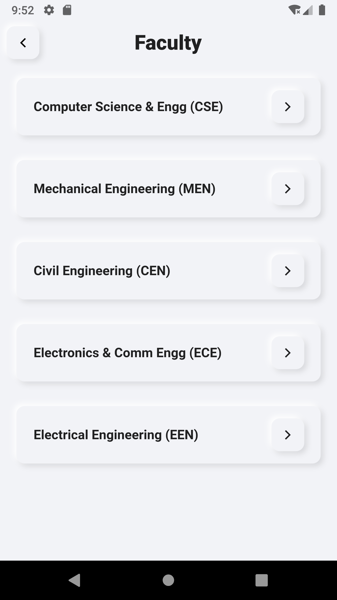
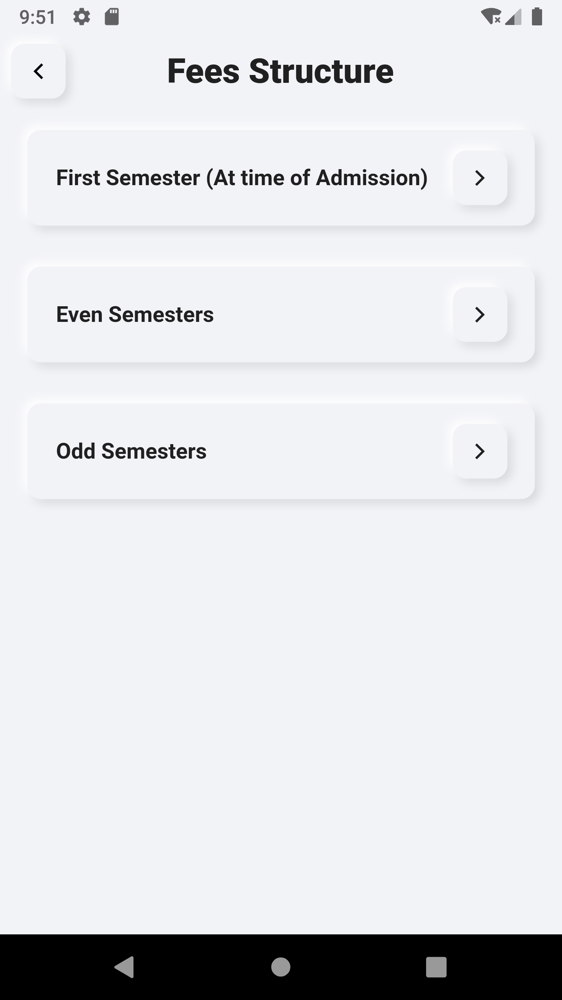

# Aliah-University-App

App made using Flutter for Aliah University Kolkata, West Bengal, India

## Screenshots

<table>
  <tr>
    <td>
Home Screen
</td>
    <td>
Calendar
</td>
    <td>
Present day in purple and selected day in pink
</td>
  </tr>
  <tr>
    

    <td></td>
    <td></td>
    <td></td>
    

  </tr>
  <tr>
    <td>
Courses
</td>
    <td>
UG Courses
</td>
    <td>
PG Courses
</td>
  </tr>
  <tr>
    <td></td>
    <td></td>
    <td></td>
  </tr>
  <tr>
    <td>
Faculty
</td>
    <td>
Fees Structure
</td>
    <td>
Semester Fees
</td>
  </tr>
  <tr>
    <td></td>
    <td></td>
    <td></td>
  </tr>
 </table>
